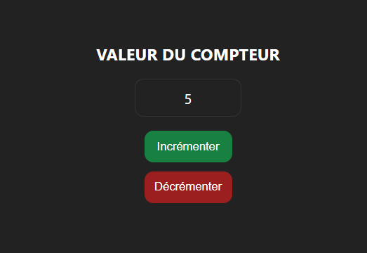
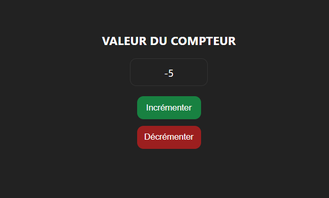

# COMPTE RENDU TD4

## MODULES ES6

### A L’ANCIENNE
On créer tous les dossiers et fichiers nécessaires pour la suite du TP.
On déclare une variable counter dans le fichier "counter.js" et on l'affiche dans dans la console dans le fichier "application.js" :
```javascript
let counter = 0;
```
```javascript
console.log(counter);
```
On ajoute nos scripts dans le fichier HTML :
```html
…
<script src="js/models/counter.js"></script>
<script src="js/application/application.js"></script>
…
```
On obtient alors "0" dans la console.
### AVEC LES MODULES
Lorsqu'on retire "counter.js" du fichier HTML, on obtient l'erreur suivante : ```Uncaught ReferenceError: counter is not defined```.

Cela s'explique car le fichier "counter.js" n'est pas importé dans le fichier HTML, du point de vu de "application.js" la variable counter n'est donc pas définie.
### UN PEU MIEUX
Pour éviter de passer par une variable globale on peut utiliser une fonction. On modifie donc le fichier "counter.js" comme suit :
```javascript
let counter = 0;
export function getCounter() {
return counter;
}
```
On obtient une erreur dans le fichier "application.js" car la variable counter est inconnue du point de vu de "application.js" car elle n'a plus le mot clé 'export' devant elle.
Il faut donc modifier le fichier "application.js" pour utiliser cette fonction :
```javascript
import { getCounter } from "./../models/counter.js";
console.log(getCounter());
```
## PREMIERE CLASSE
On créer la classe "Counter" dans le fichier "counter.js" :
```javascript
export class Counter
{

    #number;

    constructor()
    {
        this.#number = 0;
    }
    getValue()
    {
        return this.#number;
    }
    incrementValue()
    {
        this.#number++;
    }
    decrementValue()
    {
        this.#number--;
    }
}
```
On modifie ensuite le fichier "application.js" pour utiliser cette classe :
```javascript
import { Counter } from "./../models/counter.js";
const counterInst = new Counter();
console.log(counterInst.getValue());
```
### GETTER ET SETTER
On remplace la fonction getteur de la classe "Counter" par un accesseur :
```javascript
get number()
    {
        return this.#number;
    }
```
On modifie ensuite le fichier "application.js" pour utiliser cet accesseur :
```javascript
import { Counter } from "./../models/counter.js";
const counterInst = new Counter();
console.log(counterInst.number);
```

## SUJET/OBSERVATEUR
On implémente  l'interface "Observer" :
```javascript
export class Observer
{
    notify()
    {
        throw new Error("You have to define this function !");
    }
}
```

## MODELE / VUE / CONTROLEUR

### CONTROLEUR
On implémente le controleur, en respectant les consignes
```javascript
export class Controller extends Notifier
{

    #counter;

    constructor()
    {
        super();
        this.#counter = new Counter();
    }
    getCounterValue()
    {
        return this.#counter.number;
    }
    incrementCounter()
    {
        this.#counter.incrementValue();
        this.notify();
    }
    decrementCounter()
    {
        this.#counter.decrementValue();
        this.notify();
    }
}
```
### VUE
 En implémentant maintenant la vue, on va pouvoir gérer l'affichage et la gestion de click:
```javascript
export class View extends Observer{
    #controller;
    constructor(controller) {
        super();
        this.#controller = controller;
        this.#controller.addObserver(this);
        const incrementButton = document.querySelector("#btn-increment");
        incrementButton.addEventListener("click",() => this.#controller.incrementCounter());
        const decrementButton = document.querySelector("#btn-decrement");
        decrementButton.addEventListener("click",() => this.#controller.decrementCounter());
    }
    notify() {
        const txt = document.querySelector("#txt-counter");
        txt.innerHTML = this.#controller.getCounterValue();
    }
}
```

Grâce à la vue et au controleur, on peut maintenant incrémenter et décrémenter la valeur du compteur en cliquant sur les boutons correspondants:





## CONCLUSION

Ce TD nous a permis d'approfrondir nos connaisances sur le dernier cours à propos des classes.
Le modèle MVC est un concept très important en programmation, il permet de séparer les différentes parties d'un programme pour une meilleure lisibilité et une meilleure maintenance.
Nous avons pu voir comment implémenter ce modèle, avec une vue et un controleur en utilisant les classes ES6.
Nous avons aussi pu voir comment utiliser les interfaces et les accesseurs en JavaScript.
De bien comprendre le fonctionnement vue/controleur était un peu complexe mais s'avère très utile.